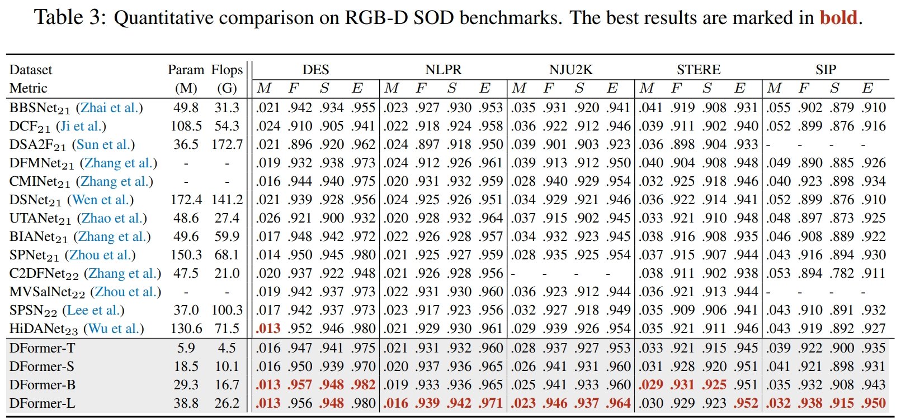

# <p align=center>`RGB-D Salient Object Detection in DFormer`</p>

[](https://paperswithcode.com/sota/rgb-d-salient-object-detection-on-des?p=dformer-rethinking-rgbd-representation)
[](https://paperswithcode.com/sota/rgb-d-salient-object-detection-on-stere?p=dformer-rethinking-rgbd-representation)
[](https://paperswithcode.com/sota/rgb-d-salient-object-detection-on-sip?p=dformer-rethinking-rgbd-representation)
[](https://paperswithcode.com/sota/rgb-d-salient-object-detection-on-nlpr?p=dformer-rethinking-rgbd-representation)
[](https://paperswithcode.com/sota/rgb-d-salient-object-detection-on-nju2k?p=dformer-rethinking-rgbd-representation)


> **Authors:**
> [Bowen Yin](https://scholar.google.com/citations?user=xr_FRrEAAAAJ&hl=zh-CN&oi=sra),
> [Xuying Zhang](https://scholar.google.com/citations?hl=zh-CN&user=huWpVyEAAAAJ),
> [Zhongyu Li](https://scholar.google.com/citations?user=g6WHXrgAAAAJ&hl=zh-CN),
> [Li Liu](https://scholar.google.com/citations?hl=zh-CN&user=9cMQrVsAAAAJ),
> [Ming-Ming Cheng](https://scholar.google.com/citations?hl=zh-CN&user=huWpVyEAAAAJ),
> [Qibin Hou*](https://scholar.google.com/citations?user=fF8OFV8AAAAJ&hl=zh-CN)


This official repository contains the RGB-D SOD code of paper 'DFormer: Rethinking RGBD Representation Learning for Semantic Segmentation'. The technical report could be found at [arXiv](https://arxiv.org/pdf/2309.09668.pdf). 

We invite all to contribute in making it more acessible and useful. If you have any questions about our work, feel free to contact me via e-mail (bowenyin@mail.nankai.edu.cn). If you are using our code and evaluation toolbox for your research, please cite this paper ([BibTeX](https://scholar.googleusercontent.com/scholar.bib?q=info:GdonbkKZMYsJ:scholar.google.com/&output=citation&scisdr=ClEqKQU5EL_6hIbkmOc:AFWwaeYAAAAAZQvigOeM_E2bhS0d1niD6tYkedk&scisig=AFWwaeYAAAAAZQvigF3P1qyHXOMhOEt-zalsD8w&scisf=4&ct=citation&cd=-1&hl=zh-CN)).


**1. Preparation.**

The training and testing experiments  for DFormer-SOD are conducted on one NVIDIA Tesla 3090 GPU with 24 GB memory.

- **Requirement**
The requirements for DFormer-SOD is the same as [DFormer](https://github.com/VCIP-RGBD/DFormer).
If you have installed it, you can skip this.

```
conda create -n dformer python=3.10 -y
conda activate dformer
pip install torch==1.11.0+cu113 torchvision==0.12.0+cu113 torchaudio==0.11.0 --extra-index-url https://download.pytorch.org/whl/cu113
pip install mmcv-full -f https://download.openmmlab.com/mmcv/dist/cu113/torch1.11/index.html
pip install tqdm opencv-python scipy tensorboardX tabulate easydict
```

- **Datasets:** 

Download training dataset at
[Google Drive](https://drive.google.com/file/d/1Orss85k3wEUgDhItwT1goEN6WQFA1SOw/view?usp=sharing). 
Then move it into `./Data/`.

Download testing dataset at [Google Drive](https://drive.google.com/file/d/1sWJqCg2dAKSSkfrvB7zkwwsW6Ybd4Gd1/view?usp=sharing) and move it into `./Data/`.

- **Checkpoints:** 

ImageNet-1K Pre-trained DFormers T/S/B/L can be downloaded at 

| Pre-trained | [GoogleDrive](https://drive.google.com/drive/folders/1YuW7qUtnguUFkhC-sfqGySrerjK0rZJX?usp=sharing) | [OneDrive](https://mailnankaieducn-my.sharepoint.com/:f:/g/personal/bowenyin_mail_nankai_edu_cn/EhTTF_ZofnFIkz2WSDFAiiIBEIubZUpIwDQYwm9Hvxwu8Q?e=x8XumL) | [BaiduNetdisk](https://pan.baidu.com/s/1JlexzFqMcZOXPNiNkE1zRA?pwd=gct6) | 
|:---: |:---:|:---:|:---:|

- **Trained Weight:**

DFormer-L
[BaiduNetDisk](https://pan.baidu.com/s/1gVlaSimfSLyVXuxcqylpug?pwd=op1n)

- **Predicted Saliency Maps:**

DFormer-L
[BaiduNetDisk](https://pan.baidu.com/s/1NyoycXV6JQoSc7vNAGfFVw?pwd=cf7s)


<details>
<summary>Orgnize the checkpoints and dataset folder in the following structure:</summary>
<pre><code>

```shell
<Checkpoint>
|-- <pretrained>
    |-- <DFormer_Large.pth.tar>
    |-- <DFormer_Base.pth.tar>
    |-- <DFormer_Small.pth.tar>
    |-- <DFormer_Tiny.pth.tar>
|-- <trained>
    |-- <DFormer_SOD_epoch_best.pth>
<Data>
|-- <TrainDataset>
    |-- <RGB>
        |-- <name1>.<ImageFormat>
        |-- <name2>.<ImageFormat>
        ...
    |-- <Depth>
        |-- <name1>.<DepthFormat>
        |-- <name2>.<DepthFormat>
    |-- <GT>
        |-- <name1>.<DepthFormat>
        |-- <name2>.<DepthFormat>
|-- <TestDataset>
|-- ...
```

</code></pre>
</details>

**2. Train.**

```
python train.py
```


**3. Eval.**


```
python test_produce_maps.py
python test_evaluation_maps.py
```


## 🚩 Performance


<p align="center">
     <br />
    <em> 
    </em>
</p>


> We invite all to contribute in making it more acessible and useful. If you have any questions or suggestions about our work, feel free to contact me via e-mail (bowenyin@mail.nankai.edu.cn) or raise an issue. 


## Reference
You may want to cite:
```
@article{yin2023dformer,
  title={DFormer: Rethinking RGBD Representation Learning for Semantic Segmentation},
  author={Yin, Bowen and Zhang, Xuying and Li, Zhongyu and Liu, Li and Cheng, Ming-Ming and Hou, Qibin},
  journal={arXiv preprint arXiv:2309.09668},
  year={2023}
}
```


### Acknowledgment

Our implementation is mainly based on [mmsegmentaion](https://github.com/open-mmlab/mmsegmentation/tree/v0.24.1), and [SPNet](https://github.com/taozh2017/SPNet). Thanks for their authors.


### License

Code in this repo is for non-commercial use only.


